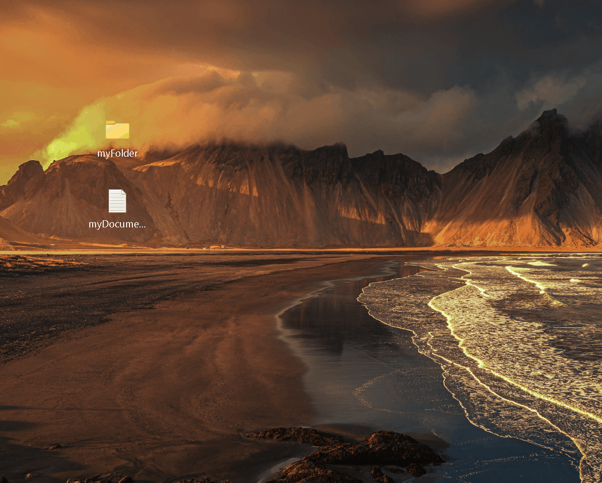

<!-- Back to top link -->

<h1>Hi, I'm <b>Luis Fabian Galvez</b>,  <a href="https://linkedin.com/in//luisfabian-g/">IT Support Specialist</a> <a href="https://www.github.com/lufagee/">and DIY Tech Enthusiast</h1>

#### Bridging the gap between end-user and machine with simple, graphic $${\color{green}"how-to"}$$ tutorials.   
<!-- PROJECT LOGO -->

  

 

<h2><b>👯 Walkthrough Example:</b></h2>

Tutorials are showcased through gifs made and edited with <a href="https://github.com/NickeManarin/ScreenToGif#--screentogif---screentogifcom"><b>ScreenToGif</b></a>

<ol>ScreenToGif is a free to use, user-friendly application that allows you to turn screen recordings into gifs.</b>
</ol>

Gif Tutorial Example: <b>Hiding Desktop Icons</b>

<ol>

</ol>
<a href="https://github.com/lufagee/Hide-the-Recycle-Bin/blob/main/README.md#colorgreenhide-space-the-space-recycle-space-bin">Walkthrough Example: Hide the Recycle Bin with <b>gpedit.msc</b></a>

 
 

 
<h2>👨‍💻 IT Support Projects & Simple Walkthroughs:</h2>

<h3><a href="https://github.com/lufagee/Virtualization">Virtualization</a></h3>

[Getting Started with Virtualization & Linux Distros](https://github.com/lufagee/Virtualization/blob/main/README.md#colorhotpinkgetting-space-started-space-with-space-virtualization)
  - [Oracle VirtualBox VM Aquisition & Installation](https://github.com/lufagee/Virtualization?tab=readme-ov-file#oracle-virtualbox-vm-aquisition--installation) 
  
  - [Debian GNU/Linux ISO Aquisition & Installation](https://github.com/lufagee/Virtualization?tab=readme-ov-file#debian-gnulinux-iso-aquisition--installation)
    - [Gnome Desktop Environment](https://github.com/lufagee/Virtualization/edit/main/README.md#gnome-desktop-environment)
<!--  - Kali-Linux (**Documentation complete, Media in progress, Release date: 10/10/2025) -->
 

<h3><a href="https://github.com/lufagee/System-Administration">System Administration</a></h3>

[Getting Started with Windows Server & Active Directory](https://github.com/lufagee/System-Administration/blob/main/README.md#colorhotpinkgetting-space-started-space-with-space-windows-space-server)
  - [Windows 11 ISO Aquisition & Installation](https://github.com/lufagee/System-Administration?tab=readme-ov-file#window-windows-11-iso-aquisition--installation)
  
  - [Windows Server 2025 Evaluation Aquisition & Installation](https://github.com/lufagee/System-Administration?tab=readme-ov-file#file_cabinet-windows-server-2025-iso-aquisition--installation)
  
  - [Active Directory Installation](https://github.com/lufagee/System-Administration?tab=readme-ov-file#card_file_box-active-directory)
    - [User, Group, and Object Management](https://github.com/lufagee/System-Administration?tab=readme-ov-file#user-group-and-object-management)
    
    - [Create New OU with PowerShell ISE Script](https://github.com/lufagee/System-Administration?tab=readme-ov-file#create-new-ou-with-powershell-ise)
    
    - [Create 10 New Users with PowerShell ISE Script](https://github.com/lufagee/System-Administration?tab=readme-ov-file#create-10-new-users-with-powershell-ise)

 

<h3><a href="https://github.com/lufagee/SHA256-Checksum-Verification-Guide/blob/main/README.md#-sha256-checksum-verification-guide">🔒 SHA256 Checksum Verification Guide</a></h3>

<a href="https://github.com/lufagee/SHA256-Checksum-Verification-Guide?tab=readme-ov-file#-quick-reference-table">Quick Reference Table</a>

<ol> 

| Platform               | Command                                           |
| ---------------------- | ------------------------------------------------- |
| **Windows PowerShell** | `Get-FileHash -Path "filePath" -Algorithm SHA256` |
| **Windows CMD**        | `certutil -hashfile "filePath" sha256`            |
| **Linux**              | `sha256sum ~/fileLocation/fileName.fileType`      |
| **macOS**              | `shasum -a 256 ~/fileLocation/fileName.fileType`  |
| **Cross-platform**     | `openssl sha256 ~/fileLocation/fileName.fileType` |
    
</ol>

- [Windows PowerShell Method](https://github.com/lufagee/SHA256-Checksum-Verification-Guide?tab=readme-ov-file#windows-powershell-method)
  - [Windows CLI Method](https://github.com/lufagee/SHA256-Checksum-Verification-Guide?tab=readme-ov-file#windows-command-prompt-method)
  
- [Linux Method](https://github.com/lufagee/SHA256-Checksum-Verification-Guide?tab=readme-ov-file#linuxmacos-cli-method)

- [macOS Method](https://github.com/lufagee/SHA256-Checksum-Verification-Guide?tab=readme-ov-file#linuxmacos-cli-method)

  - [Verification Steps](https://github.com/lufagee/SHA256-Checksum-Verification-Guide?tab=readme-ov-file#-verification-steps-)
  
  - [Security Best Practices](https://github.com/lufagee/SHA256-Checksum-Verification-Guide?tab=readme-ov-file#%EF%B8%8F-security-best-practices)

 

<h3>Imaging & Cloning</h3>

Rufus Aquisition & Installation 
  - Create a bootable USB Flash Drive 
Clonezilla Aquisition and Installation 
  - Clone/Image a hard drive 
  
>    
> **Documentation nearing completion, Media complete, Release date: 10/8/2025)**
 

<h3>Disk Sanitization & Formatting</h3> 
Jwipe with PowerShell  
  - ("zeroing" out a storage drive) 
DiskPart through GUI and CLI 
  - Format storage drive 

>    
> **Documentation nearing completion, Media nearing completion, Release date: 10/10/2025)**
 

(<a href="#readme-top"><strong>back to top »</strong></a>)

